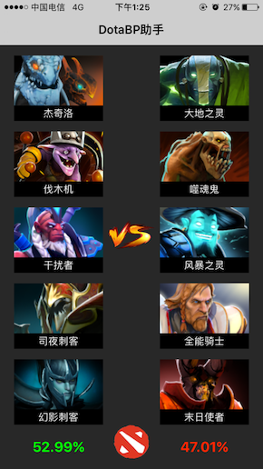
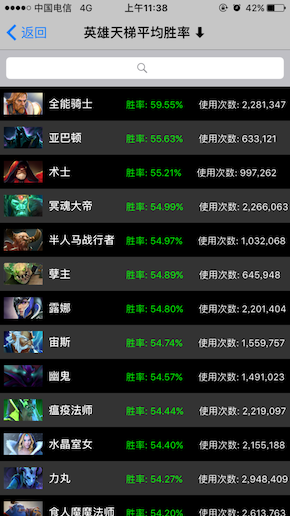
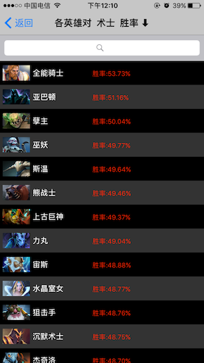
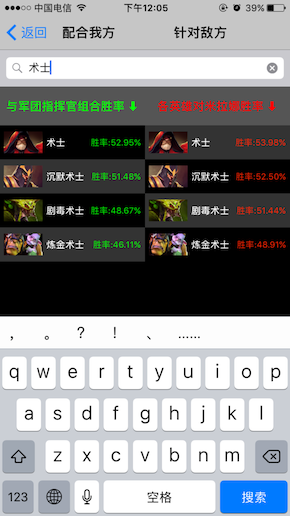
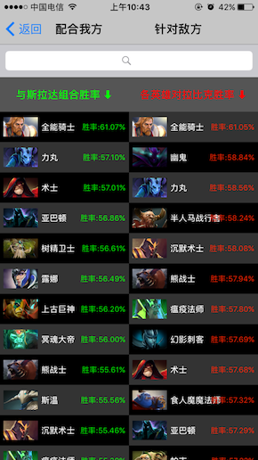

# DotaBPAssistant
刀塔BP助手通过英雄胜率组合计算,帮助用户在游戏的选英雄阶段提供选人参考，根据115个英雄之间的配合胜率和相互克制胜率，来预测整个阵容胜率，帮助用户更好的提高自身电竞水平和选人经验。


# 使用截图
  
 

# 数据来源
* 抓取dotamax全球一个月内全部分段的天梯数据页面
   * http://www.dotamax.com/hero/rate/?ladder=y
* 抓取克制该英雄的页面
  * http://www.dotamax.com/hero/detail/match_up_anti/axe/?ladder=y
* 抓取配合该英雄的页面
  * http://www.dotamax.com/hero/detail/match_up_comb/axe/?ladder=y
  
# 过滤数据
* 对网页源码通过正则表达式过滤获取有效数据
  * 当前英雄的胜率表格
  ```swift
  <tr><td style[\s\S]+?</td></tr>
  ```
  * 当前英雄的数据
  ```swift
  >([^<]+).<
  ```
  * 将每个英雄的表格取出
  ```swift
  <tr><td>[\s\S]+?</td></tr>
  ``` 
  * 获取内部字符串:英雄名,克制指数,胜率,使用次数
  ```swift
  >([^<|\s]+).<
  ```   
  * 获取英雄头像地址url
  ```swift
  src="[\s\S]+?>
  ```     
  * 获取单个英雄中其他英雄的英文名
  ```swift
  <tr><td><a href="/hero/detail/[\s\S]+?>
  ```    

 # 胜率算法
 天辉夜魇各5名英雄
 * 双方5个英雄两两组合,C(5,2)=10,即有10种组合方式,求平均的组合胜率
 ```swift
 /*组合算法*/
     func combine(array:Array<HeroModel>,arrayIndex:Int,resultArray: inout Array<HeroModel>,resultIndex:Int) -> Void {
        let resultLen = resultArray.count;
        let resultCount = resultIndex + 1;
        
        if resultCount > resultLen {
            allRadiantCombineArray.append(resultArray);
            //print(resultArray)
            return;
        }
        
        for i in arrayIndex..<(array.count + resultCount - resultLen) {
            resultArray[resultIndex] = array[i];
            combine(array: array, arrayIndex: i + 1, resultArray: &resultArray, resultIndex: resultIndex + 1);
            
        }
    }
 ```
 
 * 5个英雄每次重新排列顺序,与对方一一对应可能为P(5,5)=120,即有120种排列方式
 ```swift
     /*全排列算法*/
    func perm(array: inout Array<HeroModel>, start:Int ,end:Int) -> Void {
        
        if start == end {
            var newArray:[HeroModel] = [];
            for i in 0...end {
                newArray.append(array[i]);
            }
            //print(newArray)
            //添加到二维数组中
            allPermArray.append(newArray)
            
        } else {
            
            for i in start...end {
                let temp = array[start];
                array[start] = array[i];
                array[i] = temp;
                perm(array: &array, start: start + 1, end: end);
                array[i] = array[start];
                array[start] = temp;
            }
        }
        
        
    }
 ```
 
  *每一种对阵情况(总共120种),采用如下胜负模型,5名英雄按照3个胜作为胜率计算依据(情况包括全胜,4人胜,3人胜),最后统计求平均得出胜率,和10种组合胜率的平均来计算最终的胜率.

# Remind
* swift 3.0
* Xcode 8.3
* 语言表述可能不够详实,下载即可运行,详情请见代码...
